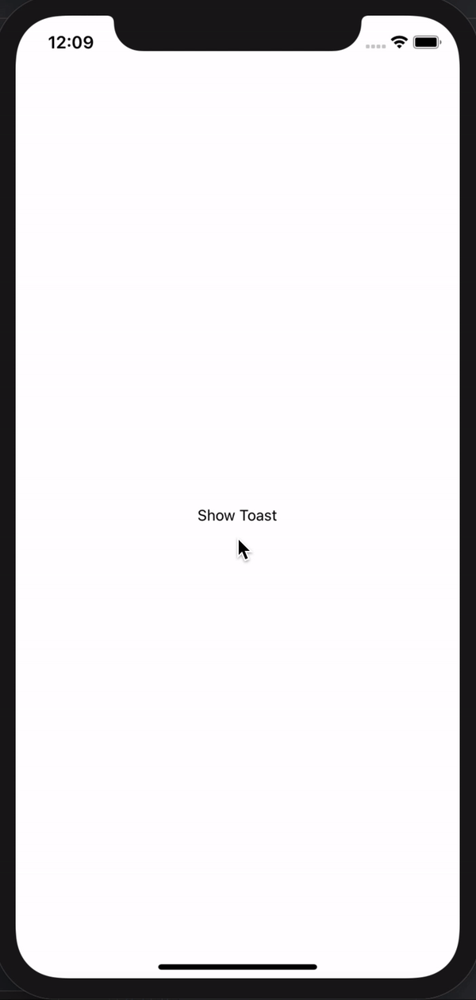

# react-native-small-toast


[](https://www.npmjs.com/package/react-native-small-toast)

## Getting started

`$ npm install react-native-small-toast --save`



## Usage
```javascript
// First add the components to your root file App.js
import Toast from 'react-native-small-toast';

const App = () => {
    return (
      <>
        <Toast ref={(ref) => Toast.setRef(ref)} />
            // <YourComponents/> here
      </>
    );
}

export default App;
```

// Now import it anywhere in your app and use it

```javascript
import { Text, TouchableOpacity } from 'react-native';
import Toast from 'react-native-small-toast';

export default ExampleToast () => {
    const onClickChange = () => {
        Toast.show({
            text: "React Native Toast component for both Androi and iOS",
            bgColor: '#000000',
            color: '#FFFFFF',
    })
    }
    return (
        <TouchableOpacity onPress={onClickChange}>
            <Text>Show Toast</Text>
        </TouchableOpacity>
    )
};
```
